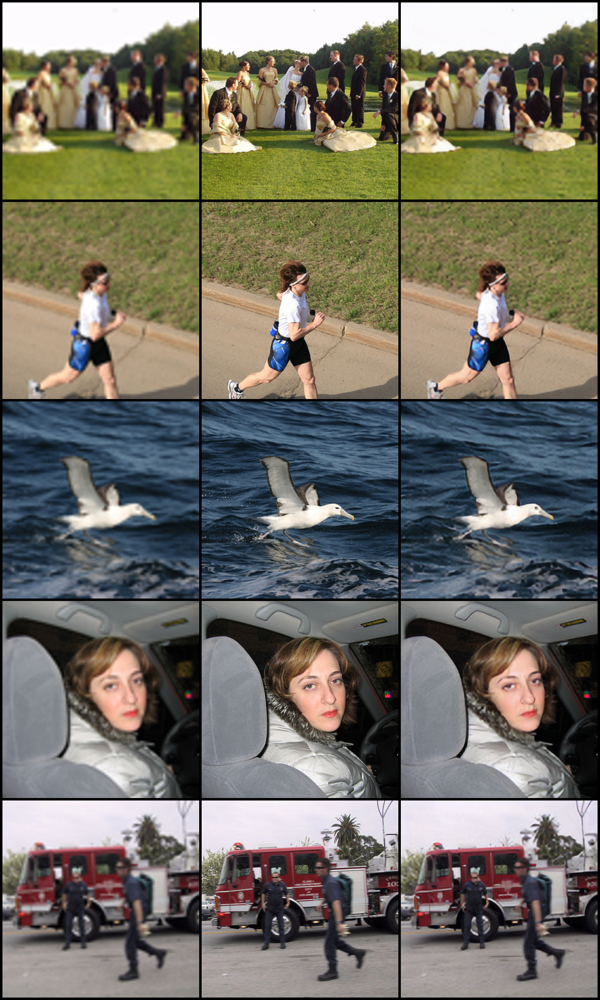
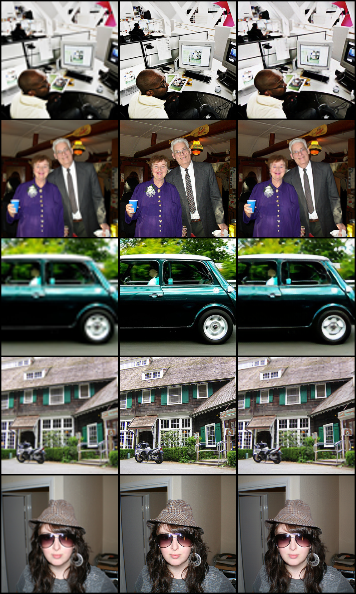

# SRGAN  
This project is an implementation based on the [SRGAN](https://github.com/leftthomas/SRGAN) project with some modifications. I provides model weights trained for 100 epochs with a 4x upscaling factor on the VOC2012 dataset.
## Requirments  
`pip install requirements.txt`  
## Datsets  
### Train, Val Dataset  
The train and val datasets are sampled from VOC2012. Train dataset has 16700 images and Val dataset has 425 images. Download the datasets from [here](https://drive.google.com/file/d/1q7C50ysB6c_MDUpX1BrQNB8VpuVqXyTe/view?usp=sharing)(Google Drive Link). Then put the training dataset into the `data/DIV2K_train_HR` folder and place the validation dataset into the `data/DIV2K_valid_HR` folder.  
## Usage  
Create two empty folders and name them `epochs` and `statistics` respectively.  
Train  
```
python train.py

optional arguments:
--crop_size                   training images crop size [default value is 88]
--upscale_factor              super resolution upscale factor [default value is 4](choices:[2, 4, 8])
--num_epochs                  train epoch number [default value is 100]
```  
Test Single Image  
```
python test_image.py

optional arguments:
--upscale_factor              super resolution upscale factor [default value is 4]
--test_mode                   using GPU or CPU [default value is 'GPU'](choices:['GPU', 'CPU'])
--image_name                  test low resolution image name
--model_name                  generator model epoch name [default value is netG_epoch_4_100.pth]
```  
## Train results  
### train & val curve  
  
### An example of the model trained for 100 epochs on the validation set.  
**Upscale Factor = 4**  
The leftmost column is the low-resolution image obtained by interpolation using the BICUBIC method. The middle column is the original high-resolution image, and the rightmost column is the super-resolution image reconstructed using the model.   
    
  
The outputs of the validation dataset on the model trained for 100 epochs are all located in the `training_results\SRF_4` folder.
