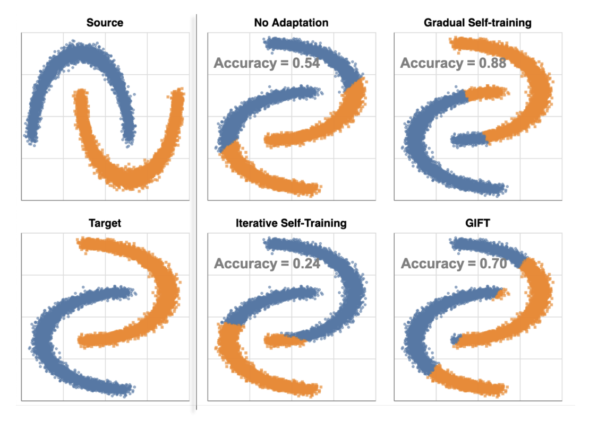

Gradual Domain Adaptation in the Wild: When Intermediate Distributions are Absent
==



This repository contains implementation of GIFT (Gradual Interpolation of Features toward Target), and other self-training based approaches to shift the model towards the target distribution. It has been shown that under the following two assumptions: (a) access to samples from intermediate distributions, and (b) samples being annotated with the amount of change from the source distribution, self-training can be successfully applied on gradually shifted samples to adapt the model toward the target distribution. We hypothesize having (a) is enough to enable iterative self-training to slowly adapt the model to the target distribution, by making use of an implicit curriculum. In the case where (a) does not hold, we observe that iterative self-training falls short. We propose GIFT, a method that creates virtual samples from intermediate distributions by interpolating representations of examples from source and target domains. We evaluate an iterative-self-training method on datasets with natural distribution shifts, and show that when applied on top of other domain adaptation methods, it improves the performance of the model on the target dataset. We run an analysis on a synthetic dataset to show that in the presence of (a) iterative-self-training naturally forms a curriculum of samples. Furthermore, we show that when (a) does not hold, GIFT performs better than iterative self-training.
Details can be found in the [paper](https://arxiv.org/abs/2106.06080).

## Getting Started

This project is developed in JAX and uses
[Flax](https://github.com/google-research/flax).

The code base supports different training pipelines, with different objectives, for different models and on different datasets. 
To have this flexibility, we have abstractions for the following concepts:

    Pipeline
    ├── Training/Evaluation # pipeline defines the training regime, e.g. standard end2end training, iterative self-training or distillation.
    │
    ├── Task
    │      ├── **Dataset
    │      ├── Objective function # loss function
    │      └── Metrics # evaluation
    │
    └── Model
           ├── Flax Module
           └── Model utilities # some functions for building and testing the flax module

#### Pipelines
A Pipeline determines the  main flow of the experiments. We can have different 
kinds of pipelines. For instance a training+evaluation pipeline, or an 
evaluation only pipeline (that uses pretrained models).
A pipeline for training mainly consists of loading the task 
and the model, training loop that is based on a specific training  strategy 
(e.g., end-to-end training), and evaluating and checkpointing the trained model.
For training+evaluation, we have a basic Trainer class, `Trainer`, that all 
training+evaluation pipelines are supposed to inherit from it. 

The training pipeline for GIFT is: **GradualDomainAdaptationWithMixup**

List of other implemented pipelines:

* **End2end**: 
A pipeline for standard end-to-end training, where the loss function 
is computed given the final output of a model and all the layers/parameters of 
the model get updated by end-to-end backpropagation.
* **MultiEnvEnd2End**: An End2End pipeline when we have multiple labeled training datasets (with the same task and output space).
* **MultiEnvReps2Reps**: A pipeline for training a model on multiple source datasets, where the objective function can depend on the representations at different layers of the model.
* **ManifoldMixup**: A standard training pipeline with manifold mixup.
* **MultiEnvManifoldMixup**: A training pipeline with maniofold mixup when we have multiple source datasets.
* **SelfAdaptiveGradualTrainer**: A pipeline for gradual self-training.
* **StudentEnd2EndTrainer**: Distillation pipeline.
* **StudentMultiEnvEnd2EndTrainer**:  Distillation pipeline for multiple source datasets.

#### Tasks
A Task is a class that has all the information about the dataset, 
training objective, and evaluation metrics. For example, we can use the same 
dataset, e.g. MNIST, with different objectives like self-supervised 
representation learning, classification, segmentation, etc., and we can have 
a separate MNIST task for each of these objectives. We have a basic Task class, 
`Task`, that all tasks are supposed to inherit from it. 

List of Implemented Tasks:

* **ClassificationTask**: Standard Classification
* **MultiEnvClassificationTask**: Standard Classification for multiple source datasets.
* **MultiEnvIRMClassificationTask**: Classification with IRM.
* **MultiEnvVRexClassificationTask**: Classification with VREx.
* **MultiEnvDannClassification**: Classification task for Domain Adversarial Neural Network training.
* **MultiEnvLinearDomainMappingClassification**: Multi environment task with Linear Domain Mapping. Domain mapping adds an auxiliary loss that encourages
  the model to have equivariant representations with respect to the environment.
* **MultiEnvIdentityDomainMappingClassification**: Multi environment task with Indentity Domain Mapping. Using domain mapping with identity mapping simply means that the domain mapping loss is the L2 distance between examples from different domains.
* **MultiEnvSinkhornDomainMappingClassification**: Multi environment task with Indentity Domain Mapping and Sinkhorn alignment.

#### Datasets
A dataset class uses tfds data loaders and determines the input pipeline, e.g., 
processing examples, batching, padding, and caching. 
We have a basic Dataset class, `BaseDataset`, that all datasets 
are supposed to inherit from it. 

List of Datasets:

* CIFAR10 (different variants)
* FMoW (from the WILDS benchmark)
* Camelyon (from the WILDS benchmark)

#### Models
Models are inhertied from flax `nn.Modules`.
We have a basic model class, `BaseModel`, that all models  are supposed to 
inherit from it. 

List of Implemented Models:
* ResNet
* WideResNet


#### Example API
```
hparams = ml_collections.ConfigDict()
hparams.dataset_name = 'cifar10'
hparams.main_loss = 'categorical_cross_entropy'
...

task_cls = get_task_class('cls)
task = task_cls(hparams, num_shards)
model_cls = all_models.get_model_class('simple_cnn')
trainer = End2End(model_cls=model_cls,
                  task=task,
                  hparams=hparams,
                  experiment_dir=experiment_dir,
                  tb_summary_writer=tb_summary_writer,
                  rng=rng)

train_summary, eval_summary = trainer.train()
```

Example configs can be  found under the `experiments` dir.

## The Two-Moon Toy Example:
This [notebook](https://colab.research.google.com/github/samiraabnar/Gift/blob/main/notebooks/noisy_two_moon.ipynb)
demonstrates how GIFT can improve iterative-self-training in an example with a 
two-moon dataset, with minimal implementations of standard iterative
self-training, gradual self-training and GIFT.


## Reference

```
@article{abnar2021gradual,
  title={Gradual Domain Adaptation in the Wild: When Intermediate Distributions are Absent},
  author={Abnar, Samira and Berg, Rianne van den and Ghiasi, Golnaz and Dehghani, Mostafa and Kalchbrenner, Nal and Sedghi, Hanie},
  journal={arXiv preprint arXiv:2106.06080},
  year={2021}
}
```
