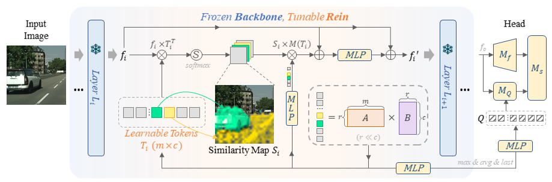
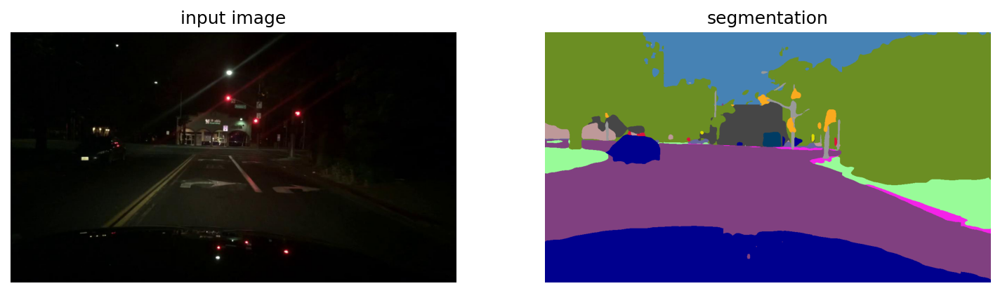

# [CVPR 2024] Stronger, Fewer, & Superior: Harnessing Vision Foundation Models for Domain Generalized Semantic Segmentation
[zhixiang wei](https://zxwei.site)<sup>1</sup>, [lin chen](https://lin-chen.site)<sup>2</sup>, et al. <br />
<sup>1</sup> University of Science of Techonology of China    <sup>2</sup> Shanghai AI Laboratory

[](https://paperswithcode.com/sota/domain-adaptation-on-cityscapes-to-acdc?p=stronger-fewer-superior-harnessing-vision) <br />
[](https://paperswithcode.com/sota/domain-generalization-on-gta-to-avg?p=stronger-fewer-superior-harnessing-vision) <br />
[](https://paperswithcode.com/sota/domain-generalization-on-gta5-to-cityscapes?p=stronger-fewer-superior-harnessing-vision) <br />
Project page: https://zxwei.site/rein

Paper: https://arxiv.org/pdf/2312.04265.pdf

Rein is a efficient and robust fine-tuning method, specifically developed to effectively utilize **Vision Foundation Models (VFMs)** for **Domain Generalized Semantic Segmentation (DGSS)**. It achieves **SOTA on Cityscapes to ACDC, and GTAV to Cityscapes+Mapillary+BDD100K**.  Using only synthetic data, Rein achieved an mIoU of **78.4\% on Cityscapes** validation set! Using only the data from the Cityscapes training set, we achieved an average mIoU of **77.6% on ACDC** test set!


## Visualization
Trained on Cityscapes, Rein generalizes to unseen driving scenes and cities: Nighttime Shanghai, Foggy Countryside, and Rainy Hollywood.

[![night]](https://user-images.githubusercontent.com/54713447/330731120-f9e3fafd-ebb7-462d-bc9b-92b1bde96e23.mp4)

[![rain]](https://user-images.githubusercontent.com/54713447/330731135-7c504893-6ead-41de-9820-b1e5ff267475.mp4)

[![fog]](https://user-images.githubusercontent.com/54713447/330731083-9ab5c758-b2b6-4eac-bb63-9a546f2f89fe.mp4)


## Performance Under Various Settings (DINOv2).

|Setting |mIoU |Config|Log & Checkpoint|
|-|-|-|-|
|**GTAV $\rightarrow$ Cityscapes**|**66.7**|[config](https://github.com/w1oves/Rein/releases/download/GTAV/config.py)|[log](https://github.com/w1oves/Rein/releases/download/GTAV/20231213_213507.json) & [checkpoint](https://github.com/w1oves/Rein/releases/download/GTAV/iter_40000_published.pth)
|+Synthia $\rightarrow$ Cityscapes|72.2|[config](https://github.com/w1oves/Rein/releases/download/GTAV%2BSynthia/config.py)|[log](https://github.com/w1oves/Rein/releases/download/GTAV%2BSynthia/20240406_170933.json) & [checkpoint](https://github.com/w1oves/Rein/releases/download/GTAV%2BSynthia/iter_40000_published.pth)|
|**+UrbanSyn $\rightarrow$ Cityscapes**|**78.4**|[config](https://github.com/w1oves/Rein/releases/download/Cityscapes/config.py)|[log](https://github.com/w1oves/Rein/releases/download/Cityscapes/20240120_154745.json) & [checkpoint](https://github.com/w1oves/Rein/releases/download/Cityscapes/citys2acdc_40k_rein_head.pth)|
|+1/16 of Cityscapes training $\rightarrow$ Cityscapes|82.5|[config](https://github.com/w1oves/Rein/releases/download/Semi-Supervised(1%2F16)/config.py)| [log](https://github.com/w1oves/Rein/releases/download/Semi-Supervised(1%2F16)/20240405_162723.json) & [checkpoint](https://github.com/w1oves/Rein/releases/download/Semi-Supervised(1%2F16)/iter_4000_published.pth)
|GTAV $\rightarrow$ BDD100K|60.0|[config](https://github.com/w1oves/Rein/releases/download/GTAV/config.py)|[log](https://github.com/w1oves/Rein/releases/download/GTAV/20231213_213507.json) & [checkpoint](https://github.com/w1oves/Rein/releases/download/GTAV/iter_40000_published.pth)
|**Cityscapes $\rightarrow$ ACDC**|**77.6**|[config](https://github.com/w1oves/Rein/releases/download/Cityscapes/config.py)|[log](https://github.com/w1oves/Rein/releases/download/Cityscapes/20240120_154745.json) & [checkpoint](https://github.com/w1oves/Rein/releases/download/Cityscapes/citys2acdc_40k_rein_head.pth)
|Cityscapes $\rightarrow$ Cityscapes-C|60.0|[config](https://github.com/w1oves/Rein/releases/download/Cityscapes/config.py)|[log](https://github.com/w1oves/Rein/releases/download/Cityscapes/20240120_154745.json) & [checkpoint](https://github.com/w1oves/Rein/releases/download/Cityscapes/citys2acdc_40k_rein_head.pth)

## Performance For Various Backbones (Trained on GTAV).

|Setting |Pretraining|Citys. mIoU |Config|Log & Checkpoint|
|-|-|-|-|-|
|ResNet50 |ImageNet1k|49.1|[config](https://github.com/w1oves/Rein/releases/download/GTAV%2BResNet50/config.py)|[log](https://github.com/w1oves/Rein/releases/download/GTAV%2BResNet50/20240119_155612.json) & [checkpoint](https://github.com/w1oves/Rein/releases/download/GTAV%2BResNet50/iter_40000_published.pth)
|ResNet101 |ImageNet1k|45.9|[config](https://github.com/w1oves/Rein/releases/download/GTAV%2BResNet101/config.py)| [log](https://github.com/w1oves/Rein/releases/download/GTAV%2BResNet101/20240124_160509.json) & [checkpoint](https://github.com/w1oves/Rein/releases/download/GTAV%2BResNet101/iter_40000_published.pth)
|ConvNeXt-Large |ImageNet21k| 57.9|[config](https://github.com/w1oves/Rein/releases/download/GTAV%2BConvNeXt-L/config.py)|[log](https://github.com/w1oves/Rein/releases/download/GTAV%2BConvNeXt-L/20240125_162647.json) & [checkpoint](https://github.com/w1oves/Rein/releases/download/GTAV%2BConvNeXt-L/iter_40000_published.pth)
|ViT-Small |DINOv2|55.3|[config](https://github.com/w1oves/Rein/releases/download/GTAV%2BViT-Small/config.py)|[log](https://github.com/w1oves/Rein/releases/download/GTAV%2BViT-Small/20240129_201817.json) & [checkpoint](https://github.com/w1oves/Rein/releases/download/GTAV%2BViT-Small/iter_40000_published.pth)
|ViT-Base |DINOv2|64.3|[config](https://github.com/w1oves/Rein/releases/download/GTAV%2BViT-Base/config.py)|[log](https://github.com/w1oves/Rein/releases/download/GTAV%2BViT-Base/20240129_201643.json) & [checkpoint](https://github.com/w1oves/Rein/releases/download/GTAV%2BViT-Base/iter_40000_published.pth)
|CLIP-Large | [OPENAI](https://openaipublic.azureedge.net/clip/models/b8cca3fd41ae0c99ba7e8951adf17d267cdb84cd88be6f7c2e0eca1737a03836/ViT-L-14.pt) | 58.1 | [config](https://github.com/w1oves/Rein/releases/download/GTAV%2BCLIP-L/config.py)|[log](https://github.com/w1oves/Rein/releases/download/GTAV%2BCLIP-L/20240508_223110.json) & [checkpoint](https://github.com/w1oves/Rein/releases/download/GTAV%2BCLIP-L/iter_40000_published.pth)
|SAM-Huge |[SAM](https://dl.fbaipublicfiles.com/segment_anything/sam_vit_h_4b8939.pth)| 59.2 | [config](https://github.com/w1oves/Rein/releases/download/GTAV%2BSAM-H/config.py)|[log](https://github.com/w1oves/Rein/releases/download/GTAV%2BSAM-H/20240515_162308.json) & [checkpoint](https://github.com/w1oves/Rein/releases/download/GTAV%2BSAM-H/iter_40000_published.pth)

## Citation
If you find our code or data helpful, please cite our paper:
```bibtex
@article{wei2023stronger,
  title={Stronger, Fewer, \& Superior: Harnessing Vision Foundation Models for Domain Generalized Semantic Segmentation},
  author={Wei, Zhixiang and Chen, Lin and Jin, Yi and Ma, Xiaoxiao and Liu, Tianle and Ling, Pengyang and Wang, Ben and Chen, Huaian and Zheng, Jinjin},
  journal={arXiv preprint arXiv:2312.04265},
  year={2023}
}
```

## 🔥 News!
* We have uploaded the config for `ResNet` and `ConvNeXt`.

* 🔥 We have uploaded the checkpoint and config for `+1/16 of Cityscapes` training set, and it get **82.5% on the Cityscapes** validation set!

* Rein is accepted in `CVPR2024`!

* 🔥 Using only the data from the Cityscapes training set, we achieved an average mIoU of **77.56% on the ACDC** test set! This result ranks **first** in the DGSS methods on the ACDC [benchmark](https://acdc.vision.ee.ethz.ch/submissions/65b6848187f1a5171cf44c34)! Checkpoint is avaliable at [release](https://github.com/w1oves/Rein/releases/tag/Cityscapes).

* 🔥 Using only synthetic data (UrbanSyn, GTAV, and Synthia), Rein achieved an mIoU of **78.4\% on Cityscapes**! Checkpoint is avaliable at [release](https://github.com/w1oves/Rein/releases/tag/UrbanSyn%2BGTAV%2BSynthia).

## Try and Test
**Experience the demo:** Users can open [demo.ipynb](demo.ipynb) in any Jupyter-supported editor to explore our demonstration.


For testing on the cityscapes dataset, refer to the 'Install' and 'Setup' sections below.
  
## Environment Setup
To set up your environment, execute the following commands:
```bash
conda create -n rein -y
conda activate rein
conda install pytorch==2.0.1 torchvision==0.15.2 torchaudio==2.0.2 pytorch-cuda=11.7 -c pytorch -c nvidia -y
pip install -U openmim
mim install mmengine
mim install "mmcv>=2.0.0"
pip install "mmsegmentation>=1.0.0"
pip install "mmdet>=3.0.0"
pip install xformers=='0.0.20' # optional for DINOv2
pip install -r requirements.txt
pip install future tensorboard
```

## Dataset Preparation
The Preparation is similar as [DDB](https://github.com/xiaoachen98/DDB).

**Cityscapes:** Download `leftImg8bit_trainvaltest.zip` and `gt_trainvaltest.zip` from [Cityscapes Dataset](https://www.cityscapes-dataset.com/downloads/) and extract them to `data/cityscapes`.

**Mapillary:** Download MAPILLARY v1.2 from [Mapillary Research](https://research.mapillary.com/) and extract it to `data/mapillary`.

**GTA:** Download all image and label packages from [TU Darmstadt](https://download.visinf.tu-darmstadt.de/data/from_games/) and extract them to `data/gta`.

Prepare datasets with these commands:
```shell
cd Rein
mkdir data
# Convert data for validation if preparing for the first time
python tools/convert_datasets/gta.py data/gta # Source domain
python tools/convert_datasets/cityscapes.py data/cityscapes
# Convert Mapillary to Cityscapes format and resize for validation
python tools/convert_datasets/mapillary2cityscape.py data/mapillary data/mapillary/cityscapes_trainIdLabel --train_id
python tools/convert_datasets/mapillary_resize.py data/mapillary/validation/images data/mapillary/cityscapes_trainIdLabel/val/label data/mapillary/half/val_img data/mapillary/half/val_label
```
(Optional) **ACDC**: Download all image and label packages from [ACDC](https://acdc.vision.ee.ethz.ch/) and extract them to `data/acdc`.

(Optional) **UrbanSyn**: Download all image and label packages from [UrbanSyn](http://www.urbansyn.org/#loaded) and extract them to `data/urbansyn`.

The final folder structure should look like this:

```
Rein
├── ...
├── checkpoints
│   ├── dinov2_vitl14_pretrain.pth
│   ├── dinov2_rein_and_head.pth
├── data
│   ├── cityscapes
│   │   ├── leftImg8bit
│   │   │   ├── train
│   │   │   ├── val
│   │   ├── gtFine
│   │   │   ├── train
│   │   │   ├── val
│   ├── bdd100k
│   │   ├── images
│   │   |   ├── 10k
│   │   │   |    ├── train
│   │   │   |    ├── val
│   │   ├── labels
│   │   |   ├── sem_seg
│   │   |   |    ├── masks
│   │   │   |    |    ├── train
│   │   │   |    |    ├── val
│   ├── mapillary
│   │   ├── training
│   │   ├── cityscapes_trainIdLabel
│   │   ├── half
│   │   │   ├── val_img
│   │   │   ├── val_label
│   ├── gta
│   │   ├── images
│   │   ├── labels
├── ...
```
## Pretraining Weights
* **Download:** Download pre-trained weights from [facebookresearch](https://dl.fbaipublicfiles.com/dinov2/dinov2_vitl14/dinov2_vitl14_pretrain.pth) for testing. Place them in the project directory without changing the file name.
* **Convert:** Convert pre-trained weights for training or evaluation.
  ```bash
  python tools/convert_models/convert_dinov2.py checkpoints/dinov2_vitl14_pretrain.pth checkpoints/dinov2_converted.pth
  ```
  (optional for 1024x1024 resolution)
  ```bash
  python tools/convert_models/convert_dinov2.py checkpoints/dinov2_vitl14_pretrain.pth checkpoints/dinov2_converted_1024x1024.pth --height 1024 --width 1024
  ```
## Evaluation
  Run the evaluation:
  ```
  python tools/test.py configs/dinov2/rein_dinov2_mask2former_512x512_bs1x4.py checkpoints/dinov2_rein_and_head.pth --backbone dinov2_converted.pth
  ```
  For most of provided release checkpoints, you can run this command to evluate
  ```
  python tools/test.py /path/to/cfg /path/to/checkpoint --backbone /path/to/dinov2_converted.pth #(or dinov2_converted_1024x1024.pth)
  ```

## Training
Start training in single GPU:
```
python tools/train.py configs/dinov2/rein_dinov2_mask2former_512x512_bs1x4.py
```
Start training in multiple GPU:
```
PORT=12345 CUDA_VISIBLE_DEVICES=1,2,3,4 bash tools/dist_train.sh configs/dinov2/rein_dinov2_mask2former_1024x1024_bs4x2.py NUM_GPUS
```
## FAQs
* [Detailed instruction for mmsegmentation.](https://mmsegmentation.readthedocs.io/en/latest/)
* [How to train on new dataset?](https://github.com/w1oves/Rein/issues/21)
* [How to visualize and save the segmentation results?](https://github.com/w1oves/Rein/issues/22)
* [How to use new checkpoint?](https://github.com/w1oves/Rein/issues/4)
* [What is the difference between the ReinMask2FormerHead and original Mask2FormerHead?](https://github.com/w1oves/Rein/issues/12)
* [Multi-gpu training problem](https://github.com/w1oves/Rein/issues/6)
* [How to Integrate Rein into Your Existing Backbone?(without mmsegmentation)](docs/easy_rein.md)
* Q: How to Visualize?
  * A: Use `tools/visualize.py`, such as :
  ``` bash
  python tools/visualize.py /path/to/cfg /path/to/checkpoint /path/to/images --backbone /path/to/converted_backbone
  ```
  here `/path/to/images` can be a filename or image folder.

* Q: Why do we need to use multiple weight files during testing?**

  * A: The weight files used during testing are:

    - **Backbone**: Pre-trained backbone weight files. Since Rein is a parameter-efficient fine-tuning method, there is no need to fine-tune the backbone. This means that for the same backbone, we only need to store one set of parameters, which can significantly reduce storage space.
      
    - **Rein_head**: Fine-tuned Rein weights and decode head weights.

## Acknowledgment
Our implementation is mainly based on following repositories. Thanks for their authors.
* [MMSegmentation](https://github.com/open-mmlab/mmsegmentation)
* [DDB](https://github.com/xiaoachen98/DDB)
* [DTP](https://github.com/w1oves/DTP)
* [UrbanSyn](http://www.urbansyn.org/#loaded)
